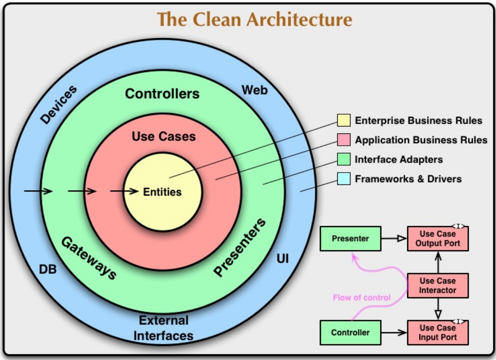

# Credit App

This is an application that allows you to generate chronograms of credit requests and list the all requests you have received.

This project uses clean architecture:



## Features

- Generating schedules for loan applications
- List of existing loan requests
- List loan requests by its identifier
- RESTful API documented with OpenAPI


## Technologies on which it is based:

- Java 11
- Spring Boot 2.7.13
- Databases: Mongo and MySql
- Docker and Docker Compose


## Installation

1. Clone this repository:
   ```
   git clone https://github.com/ElianaHuamani/app-credit-multi-module-v1
   ```
2. Navigate to the project directory:
   ```
   cd app-credit-multi-module-v1
   ```
3. Get your databases up and running with Docker Compose:
   ```
   docker-compose up -d
   ```
   This command will start the database containers defined in your docker-compose.yml file.


## API Documentation

- Rest API: [app_credit_openapi.json](docs/app_credit_openapi.json).

  See on https://editor.swagger.io


## Contact

Eliana Huamani

Project link: [https://github.com/ElianaHuamani/app-credit-multi-module-v1](https://github.com/ElianaHuamani/app-credit-multi-module-v1)